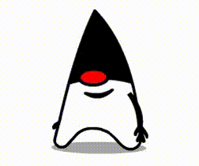

## :octocat: **About Me:**



```kotlin
object KaioA1meida {

 val name = "Kaio Almeida"
 val occupation = "Back-end Developer"
 val graduation = "BS - Computer Science"
 val aboutMe = "I'm a professional bug creator and occasional fixer.."
 val languages = listOf("Java", "Kotlin", "Python")
 val currentlyLearning = listOf("GCP", "GraphQL", "ML")

}
```

## :trophy: **GitHub Stats**

<div align="center">  
   
  
</div>

##

<div align="center"> 
 <a href="https://www.discordapp.com/users/kazzyn" target="_blank"></a> 
 <a href= "mailto:kaiohsilva04@gmail.com"></a>
 <a href="https://www.linkedin.com/in/kaioa1meida/" target="_blank"></a>


